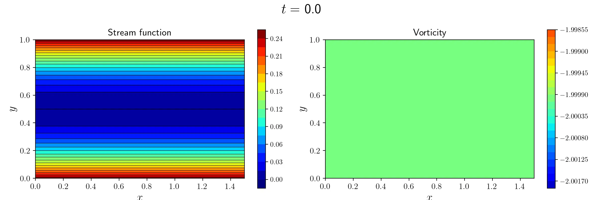
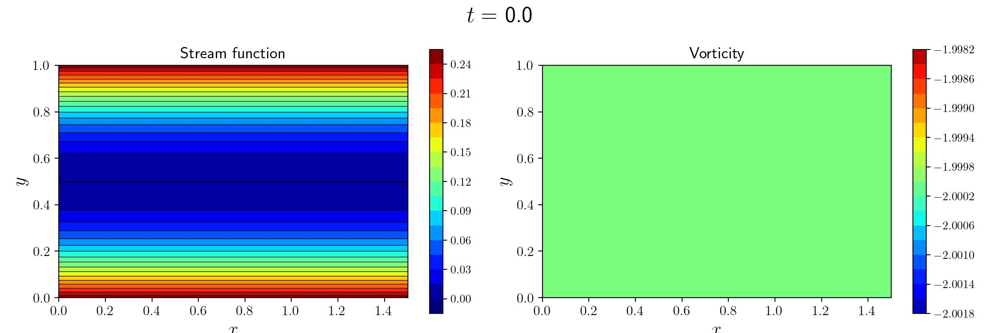

# MHD-2D-box

[](https://doi.org/10.5281/zenodo.18229345)

This Python script (`mhd2dbox.py`) simulates two-dimensional (2D) incompressible magnetohydrodynamic (MHD) flows in a box or on a beta plane with the finite difference and vorticity&ndash;stream function methods.

The non-dimensional governing equations are

```math
\frac{\partial \omega}{\partial t}+\left(v_x\frac{\partial}{\partial x}+v_y\frac{\partial}{\partial y}\right)\omega+\beta v_y\,=\,\frac{1}{Re}\left(\frac{\partial^2}{\partial x^2}+\frac{\partial^2}{\partial y^2}\right) \omega+\frac{1}{M_\mathrm{A}^2}\left(B_x\frac{\partial}{\partial x}+B_y\frac{\partial}{\partial y}\right)j\,,
```

```math
\frac{\partial A}{\partial t}+\left(v_x\frac{\partial}{\partial x}+v_y\frac{\partial}{\partial y}\right)A\,=\,\frac{1}{Rm}\left(\frac{\partial^2}{\partial x^2}+\frac{\partial^2}{\partial y^2}\right) A + \frac{g(t)}{Rm}\,,
```

where $\omega$, $A$ and $j$ are the vorticity, vector potential and electric current, respectively. Also, $\beta$, $Re$, $M_\mathrm{A}$ and $Rm$ are the non-dimensional beta parameter, Reynolds number, Alfv&eacute;n Mach number and magnetic Reynolds number, respectively. The stream function $\psi$ and vector potential $A$ are related to the 2D velocity $(v_x, v_y)$ and 2D magnetic field $(B_x, B_y)$ as

```math
v_x\,=\,\frac{\partial \psi}{\partial y},\quad v_y\,=\,-\frac{\partial \psi}{\partial x}\,,
```

```math
B_x\,=\,\frac{\partial A}{\partial y},\quad B_y\,=\,-\frac{\partial A}{\partial x}\,.
```

These equations give

```math
\omega\,=\,-\left(\frac{\partial^2}{\partial x^2}+\frac{\partial^2}{\partial y^2}\right)\psi\,,
```

```math
j\,=\,-\left(\frac{\partial^2}{\partial x^2}+\frac{\partial^2}{\partial y^2}\right)A\,.
```

In addition, the gauge term $g(t)$ is used to impose a non-uniform vector potential, $A(y)=y^2$, as the initial condition.

## Setup

It is recommended to run this script with Python 3.14 or later. First, install the required Python packages using the following command:

```sh
pip3 install -r requirements.txt
```

Additionally, the script requires the common package, `r-nakashima-geophysics/common-package` ([https://github.com/r-nakashima-geophysics/common-package.git](https://github.com/r-nakashima-geophysics/common-package.git)). For example, place the common package in the same parent directory as the script:

```sh
git clone https://github.com/r-nakashima-geophysics/common-package.git
cp -r common-package/package_common .
```

The recommended version of the common package is v1.0.1 or later.

Saving animations as MP4 files requires `ffmpeg` ([https://ffmpeg.org](https://ffmpeg.org)) to be installed.

## Usage

```sh
python3 mhd2dbox.py
```

See the docstring of the script for details.

## Examples

### Taylor-Green vortex

```python
RE = 1000
BETA_PARAM = 0
BC_VELOCITY = ('free-slip', 'free-slip')
IC_VELOCITY = ('vortex', '+')
IC_MAGNETIC = ('zero', '+')
ASPECT_RATIO = 1
NUM_X = 101
NUM_Y = 101
STRENGTH_FORCING_OMEGA = 0
STRENGTH_FORCING_POTENTIAL = 0
DT = 0.001
NUM_STEP = 10000
```


### Decaying vortex bounded by no-slip boundaries

```python
RE = 1000
BETA_PARAM = 0
BC_VELOCITY = ('no-slip', 'no-slip')
IC_VELOCITY = ('vortex', '+')
IC_MAGNETIC = ('zero', '+')
ASPECT_RATIO = 1
NUM_X = 101
NUM_Y = 101
STRENGTH_FORCING_OMEGA = 0
STRENGTH_FORCING_POTENTIAL = 0
DT = 0.001
NUM_STEP = 10000
```


### Rossby wave

```python
RE = 1000
BETA_PARAM = 10
BC_VELOCITY = ('no-slip', 'periodic')
IC_VELOCITY = ('vortex', '+')
IC_MAGNETIC = ('zero', '+')
ASPECT_RATIO = 1.5
NUM_X = 151
NUM_Y = 101
STRENGTH_FORCING_OMEGA = 0
STRENGTH_FORCING_POTENTIAL = 0
DT = 0.001
NUM_STEP = 10000
```


### Rossby wave and Western intensification

```python
RE = 1000
BETA_PARAM = 10
BC_VELOCITY = ('free-slip', 'free-slip')
IC_VELOCITY = ('zero', '+')
IC_MAGNETIC = ('zero', '+')
ASPECT_RATIO = 1.5
NUM_X = 151
NUM_Y = 101
STRENGTH_FORCING_OMEGA = 0.01
STRENGTH_FORCING_POTENTIAL = 0
X_FORCING = 0.75
Y_FORCING = 0.5
SD_FORCING = 0.05
FREQUENCY_FORCING = 0
K_FORCING = (0, 0)
DT = 0.001
NUM_STEP = 20000
```


### Rossby wave in a shear flow and its refraction at a turning latitude ($y\approx0.8$)

```python
RE = 10000
BETA_PARAM = 1000
BC_VELOCITY = ('no-slip', 'periodic')
IC_VELOCITY = ('x-linear-shear', '+')
IC_MAGNETIC = ('zero', '+')
ASPECT_RATIO = 1.5
NUM_X = 151
NUM_Y = 101
STRENGTH_FORCING_OMEGA = 0.01
STRENGTH_FORCING_POTENTIAL = 0
X_FORCING = 0.75
Y_FORCING = 0.5
SD_FORCING = 0.05
FREQUENCY_FORCING = 17.32050807568877
K_FORCING = (-28.867513459481287, -28.867513459481287)
DT = 0.0001
NUM_STEP = 10000
```

`FREQUENCY_FORCING` $\varpi$ and `K_FORCING` $(k,l)$ are obtained from

```math
k^2\,=\,\frac{\beta}{U(y_\mathrm{t})-U(y_\mathrm{c})}\,,
```

```math
l^2\,=\,\frac{\beta}{U(y_\mathrm{f})-U(y_\mathrm{c})}-k^2\,,
```

```math
\varpi\,=\,U(y_\mathrm{c})k\,,
```

where $y_\mathrm{t}$, $y_\mathrm{c}$ and $y_\mathrm{f}$ are the turning latitude, critical latitude and `Y_FORCING`, respectively. Also, $U(y)=2(y-0.5)$ is the initial (background) shear flow.



### Rossby wave in a shear flow and its absorption into a critical latitude ($y\approx0.2$)

```python
RE = 10000
BETA_PARAM = 1000
BC_VELOCITY = ('no-slip', 'periodic')
IC_VELOCITY = ('x-linear-shear', '+')
IC_MAGNETIC = ('zero', '+')
ASPECT_RATIO = 1.5
NUM_X = 151
NUM_Y = 101
STRENGTH_FORCING_OMEGA = 0.01
STRENGTH_FORCING_POTENTIAL = 0
X_FORCING = 0.75
Y_FORCING = 0.5
SD_FORCING = 0.05
FREQUENCY_FORCING = 17.32050807568877
K_FORCING = (-28.867513459481287, 28.867513459481287)
DT = 0.0001
NUM_STEP = 10000
```



### Flux expulsion

```python
RE = 1000
RM = 1000
MA = inf
BETA_PARAM = 0
BC_VELOCITY = ('free-slip', 'free-slip')
BC_MAGNETIC = ('perfect-conductor', 'periodic')
IC_VELOCITY = ('vortex', '+')
IC_MAGNETIC = ('x-uniform', '+')
ASPECT_RATIO = 1
NUM_X = 101
NUM_Y = 101
STRENGTH_FORCING_OMEGA = 0
STRENGTH_FORCING_POTENTIAL = 0
DT = 0.001
NUM_STEP = 10000
```


### Alfv&eacute;n wave

```python
RE = 100
RM = 100
MA = 1
BETA_PARAM = 0
BC_VELOCITY = ('free-slip', 'free-slip')
BC_MAGNETIC = ('perfect-conductor', 'periodic')
IC_VELOCITY = ('vortex', '+')
IC_MAGNETIC = ('x-uniform', '+')
ASPECT_RATIO = 1.5
NUM_X = 151
NUM_Y = 101
STRENGTH_FORCING_OMEGA = 0
STRENGTH_FORCING_POTENTIAL = 0
DT = 0.001
NUM_STEP = 10000
```


### Alfv&eacute;n waves in a uniform magnetic field

```python
RE = 1000
RM = 1000
MA = 1
BETA_PARAM = 0
BC_VELOCITY = ('free-slip', 'periodic')
BC_MAGNETIC = ('perfect-conductor', 'periodic')
IC_VELOCITY = ('zero', '+')
IC_MAGNETIC = ('x-uniform', '+')
ASPECT_RATIO = 1.5
NUM_X = 151
NUM_Y = 101
STRENGTH_FORCING_OMEGA = 0.01
STRENGTH_FORCING_POTENTIAL = 0
X_FORCING = 0.75
Y_FORCING = 0.5
SD_FORCING = 0.05
FREQUENCY_FORCING = 31.41592653589793
K_FORCING = (31.41592653589793, 31.41592653589793)
DT = 0.001
NUM_STEP = 1000
```


### Alfv&eacute;n waves in a non-uniform magnetic field

```python
RE = 1000
RM = 1000
MA = 1
BETA_PARAM = 0
BC_VELOCITY = ('free-slip', 'periodic')
BC_MAGNETIC = ('perfect-conductor', 'periodic')
IC_VELOCITY = ('zero', '+')
IC_MAGNETIC = ('x-linear-shear', '+')
ASPECT_RATIO = 1.5
NUM_X = 151
NUM_Y = 101
STRENGTH_FORCING_OMEGA = 0.01
STRENGTH_FORCING_POTENTIAL = 0
X_FORCING = 0.75
Y_FORCING = 0.5
SD_FORCING = 0.05
FREQUENCY_FORCING = 31.41592653589793
K_FORCING = (31.41592653589793, 31.41592653589793)
DT = 0.001
NUM_STEP = 1000
```


### (Fast magnetic) Rossby wave and Slow magnetic Rossby wave

```python
RE = 100
RM = 1000
MA = 10
BETA_PARAM = 10
BC_VELOCITY = ('free-slip', 'free-slip')
BC_MAGNETIC = ('perfect-conductor', 'periodic')
IC_VELOCITY = ('vortex', '+')
IC_MAGNETIC = ('x-uniform', '+')
ASPECT_RATIO = 1.5
NUM_X = 151
NUM_Y = 101
STRENGTH_FORCING_OMEGA = 0
STRENGTH_FORCING_POTENTIAL = 0
DT = 0.001
NUM_STEP = 50000
```


### Prograde Alfv&eacute;n wave in a non-uniform magnetic field and its refraction at a turning latitude ($y\approx0.8$)

```python
RE = 1000
RM = 10000
MA = 10
BETA_PARAM = 200
BC_VELOCITY = ('free-slip', 'periodic')
BC_MAGNETIC = ('perfect-conductor', 'periodic')
IC_VELOCITY = ('zero', '+')
IC_MAGNETIC = ('x-linear-shear', '+')
ASPECT_RATIO = 1.5
NUM_X = 151
NUM_Y = 101
STRENGTH_FORCING_OMEGA = 0
STRENGTH_FORCING_POTENTIAL = 0.01
X_FORCING = 0.75
Y_FORCING = 0.5
SD_FORCING = 0.05
FREQUENCY_FORCING = 0.7302967433402214
K_FORCING = (18.257418583505537, 24.880667576405965)
DT = 0.001
NUM_STEP = 20000
```

`FREQUENCY_FORCING` $\varpi$ and `K_FORCING` $(k,l)$ are obtained from

```math
k^2\,=\,\frac{\varpi}{k}\frac{\beta M_\mathrm{A}^2}{B^2(y_\mathrm{t})-B^2(y_\mathrm{c})}\,,
```

```math
l^2\,=\,\frac{\varpi}{k}\frac{\beta M_\mathrm{A}^2}{B^2(y_\mathrm{f})-B^2(y_\mathrm{c})}-k^2\,,
```

```math
\varpi^2\,=\,\frac{B^2(y_\mathrm{c})k^2}{M_\mathrm{A}^2}\,,
```

where $y_\mathrm{t}$, $y_\mathrm{c}$ and $y_\mathrm{f}$ are the turning latitude, critical latitude and `Y_FORCING`, respectively. Also, $B(y)=2y$ is the initial (background) magnetic field.


### Prograde Alfv&eacute;n wave in a non-uniform magnetic field and its absorption at a critical latitude ($y\approx0.2$)

```python
RE = 1000
RM = 10000
MA = 10
BETA_PARAM = 200
BC_VELOCITY = ('free-slip', 'periodic')
BC_MAGNETIC = ('perfect-conductor', 'periodic')
IC_VELOCITY = ('zero', '+')
IC_MAGNETIC = ('x-linear-shear', '+')
ASPECT_RATIO = 1.5
NUM_X = 151
NUM_Y = 101
STRENGTH_FORCING_OMEGA = 0
STRENGTH_FORCING_POTENTIAL = 0.01
X_FORCING = 0.75
Y_FORCING = 0.5
SD_FORCING = 0.05
FREQUENCY_FORCING = 0.7302967433402214
K_FORCING = (18.257418583505537, -24.880667576405965)
DT = 0.001
NUM_STEP = 20000
```


### Retrograde Alfv&eacute;n wave in a non-uniform magnetic field and its refraction at a turning latitude ($y\approx0.2$)

```python
RE = 10000
RM = 10000
MA = 10
BETA_PARAM = 100
BC_VELOCITY = ('free-slip', 'periodic')
BC_MAGNETIC = ('perfect-conductor', 'periodic')
IC_VELOCITY = ('zero', '+')
IC_MAGNETIC = ('x-linear-shear', '+')
ASPECT_RATIO = 1.5
NUM_X = 151
NUM_Y = 101
STRENGTH_FORCING_OMEGA = 0
STRENGTH_FORCING_POTENTIAL = 0.01
X_FORCING = 0.75
Y_FORCING = 0.5
SD_FORCING = 0.05
FREQUENCY_FORCING = 4.1311822359545785
K_FORCING = (-25.819888974716115, 18.946618668626837)
DT = 0.001
NUM_STEP = 10000
```


### Retrograde Alfv&eacute;n wave in a non-uniform magnetic field and its absorption at a critical latitude ($y\approx0.8$)

```python
RE = 10000
RM = 10000
MA = 10
BETA_PARAM = 100
BC_VELOCITY = ('free-slip', 'periodic')
BC_MAGNETIC = ('perfect-conductor', 'periodic')
IC_VELOCITY = ('zero', '+')
IC_MAGNETIC = ('x-linear-shear', '+')
ASPECT_RATIO = 1.5
NUM_X = 151
NUM_Y = 101
STRENGTH_FORCING_OMEGA = 0
STRENGTH_FORCING_POTENTIAL = 0.01
X_FORCING = 0.75
Y_FORCING = 0.5
SD_FORCING = 0.05
FREQUENCY_FORCING = 4.1311822359545785
K_FORCING = (-25.819888974716115, -18.946618668626837)
DT = 0.001
NUM_STEP = 10000
```


